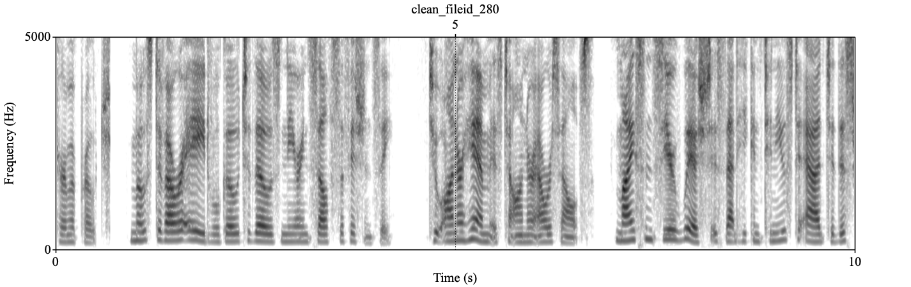
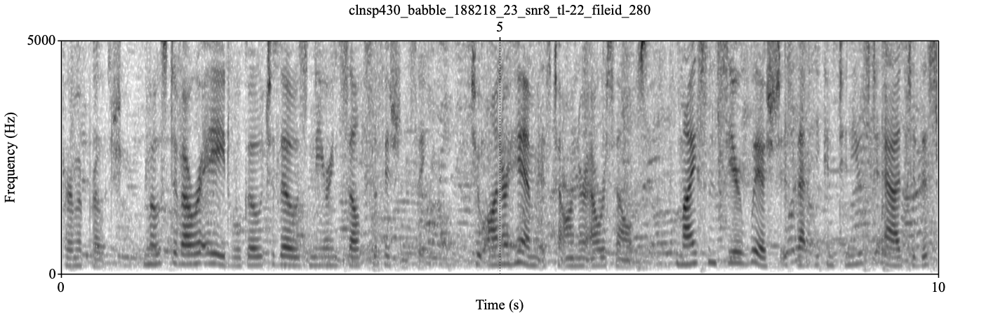
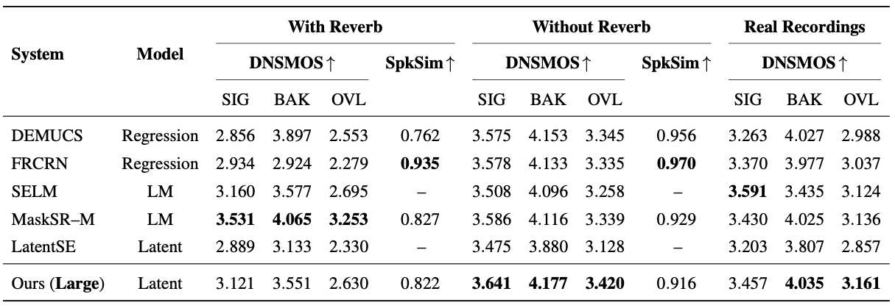

# Clean Before You Code: Denoising in Neural Audio Codec Continuous Latent Space

This repo contains the implementation from my MSc dissertation on speech denoising in neural audio codec latent space.

- **Latent-space Speech Denoiser:** Operates on **pre-quantised Descript Audio Codec (DAC) latents** at 16 kHz. Inference runs through a **encode —> denoise —> quantise —> decode** pipeline.
- **Efficient Training:** The denoiser is trained with **adversarial losses** applied directly to encoder-generated latents, bypassing the need for full codec forward passes.
- **Optimised Resource Usage:** ~20 hours wall-clock on 3× NVIDIA V100 GPUs (≈ 40k iterations).

**Note**: This project relies on DAC: [descriptinc/descript-audio-codec](https://github.com/descriptinc/descript-audio-codec)

## Repository Structure
- Core denoiser architecture: `src/denoise_module.py`
- Training script and custom data-loader: `src/train.py`, `src/dataset.py`
- Inference: `src/denoise.py` (denoise a folder of noisy WAVs)

## Example
One example from the [2020 Deep Noise Suppression Challenge](https://arxiv.org/pdf/2005.13981) dev test set illustrating denoising quality.

### Clean

[Download clean sample (WAV)](assets/babble_CLEAN.wav)

### Noisy (noise-added)

[Download noisy sample (WAV)](assets/babble_NOISY.wav)

### Denoised (noise-removed)

[Download denoised sample (WAV)](assets/babble_DENOISED.wav)

## Performance Evaluation
[DNSMOS](https://ieeexplore.ieee.org/stamp/stamp.jsp?tp=&arnumber=9746108) comparison against published results (and speaker similarity) on the DNS2020 dev test set. DNSMOS scores from 1-5, and Speaker Similarity from 0-1.



This work (Large checkpoint) compared with:
- DEMUCS (Defossez et al., 2020) — [paper](https://arxiv.org/pdf/2006.12847)
- FRCRN (Zhao et al., 2022) — [paper](https://ieeexplore.ieee.org/stamp/stamp.jsp?tp=&arnumber=9747578)
- SELM (Wang et al., 2024) — [paper](https://ieeexplore.ieee.org/stamp/stamp.jsp?tp=&arnumber=10447464)
- MaskSR (Li et al., 2024) — [paper](https://arxiv.org/pdf/2406.02092)
- LatentSE (Li et al., 2025) — [paper](https://ieeexplore.ieee.org/stamp/stamp.jsp?tp=&arnumber=10890379)

## Quickstart: Denoise a folder of WAV files

### 1) Setup Environment
Requires **Python 3.7** and **16 kHz audio inputs**. This example uses [uv](https://docs.astral.sh/uv/) for dependency management.

```bash
# Clone the repository
git clone https://github.com/ewhey22/latent-denoiser-dac.git
cd latent-denoiser-dac

# Create and activate venv
uv venv --python 3.7
source .venv/bin/activate

# Install dependencies
uv pip install -r requirements.txt
```

### 2) **Download weights**
- `codec_weights`: DAC 16 kHz weights (see DAC repo linked above).
- `denoiser_ckpt`: Pretrained **Large** checkpoint (39.4M params), available as a GitHub Release asset.
```bash
mkdir -p denoiser_weights
curl -L -o denoiser_weights/denoiser-checkpoint-L.tar https://github.com/ewhey22/latent-denoiser-dac/releases/download/v1.0.0-denoiser-39.4M/denoiser-checkpoint-L.tar
```
***Medium** checkpoint (9.5M params) available on request.*

### 3) **Run Inference:**
Update `conf/denoise.yml` with your input/output, and weights paths. 
**Note:** Input WAVs must be 16 kHz.

```bash
python src/denoise.py --config conf/denoise.yml
```
Outputs are written to your specified `output_dir` with the same filenames as the inputs.

## Training
The training script requires CUDA.

### Dataset layout
The dataloader (`src/dataset.py`) expects this folder structure:
```
<root>/
    clean/*.wav
    noisy/*.wav
    rir/*.wav (optional)
```

### Resume training from a checkpoint
See '**Download weights**' above to download required model weights (DAC + denoiser checkpoint).
Checkpoints restore model weights (denoiser, discriminator), optimiser states, and iteration count.

Single GPU:
```bash
python src/train.py --config conf/train.yml
```
Multi-GPU:
```bash
torchrun --standalone --nproc_per_node 3 src/train.py --config conf/train.yml
```

## Citation

If you use this code or find my research helpful, please cite my dissertation:

```bibtex
@mastersthesis{whey2025denoising,
  author = {William Hey},
  title  = {Clean Before you Code: Denoising in Neural Audio Codec Continuous Latent Space},
  school = {The University of Edinburgh},
  year   = {2025}
}
